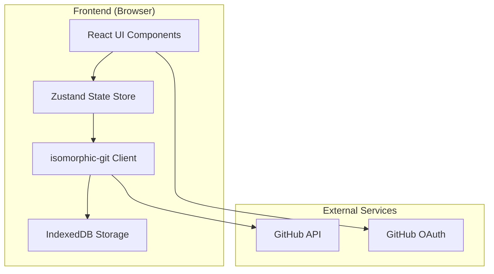
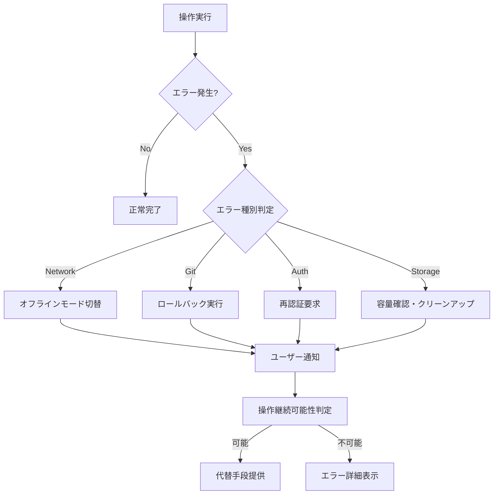

# 設計文書

## 概要

Git-Memo-Appは、Markdown形式のメモをGitベースでバージョン管理するWebアプリケーションです。単一のGitリポジトリ内で複数のメモファイルを管理し、各ファイルの変更履歴を独立して追跡します。オフライン対応とモバイルファーストのUI設計により、いつでもどこでもメモを作成・編集できます。

## アーキテクチャ

### システム構成



### 技術スタック

- **フロントエンド**: React 19 + TypeScript
- **状態管理**: Zustand（軽量・シンプル、代替案: Jotai）
- **Git操作**: isomorphic-git
- **ローカルストレージ**: IndexedDB (idb library)
- **認証**: GitHub OAuth 2.0
- **UI フレームワーク**: Tailwind CSS
- **ビルドツール**: Vite
- **デプロイ**: Vercel / Netlify

### アーキテクチャ原則

1. **オフラインファースト**: ローカルでの操作を優先し、オンライン時に同期
2. **モバイルファースト**: スマートフォンでの使用を最優先に設計
3. **シンプルさ**: 最小限の機能で最大の価値を提供
4. **データポータビリティ**: 標準的なGit + Markdownで将来性を確保

## コンポーネントとインターフェース

### コアコンポーネント

#### 1. 認証システム (AuthService)
```typescript
interface AuthService {
  loginWithGitHub(): Promise<AuthResult>
  loginLocal(credentials: LocalCredentials): Promise<AuthResult>
  logout(): Promise<void>
  getCurrentUser(): User | null
  isAuthenticated(): boolean
}
```

#### 2. メモ管理システム (MemoService)
```typescript
interface MemoService {
  createMemo(title: string, content: string): Promise<Memo>
  updateMemo(id: string, content: string): Promise<Memo>
  deleteMemo(id: string): Promise<void>
  getMemo(id: string): Promise<Memo>
  listMemos(): Promise<Memo[]>
}
```

#### 3. Git操作システム (GitService)
```typescript
interface GitService {
  initRepository(): Promise<void>
  commit(message: string, files: string[]): Promise<string>
  getHistory(filePath?: string): Promise<CommitInfo[]>
  getDiff(commitA: string, commitB: string, filePath?: string): Promise<DiffResult>
  createBranch(name: string): Promise<void>
  switchBranch(name: string): Promise<void>
  mergeBranch(sourceBranch: string, targetBranch: string): Promise<void>
  push(): Promise<void>
  pull(): Promise<void>
}
```

#### 4. 同期システム (SyncService)
```typescript
interface SyncService {
  syncToGitHub(): Promise<SyncResult>
  syncFromGitHub(): Promise<SyncResult>
  enableAutoSync(interval: number): void
  disableAutoSync(): void
  getLastSyncTime(): Date | null
}
```

#### 5. ストレージシステム (StorageService)
```typescript
interface StorageService {
  saveMemo(memo: Memo): Promise<void>
  loadMemo(id: string): Promise<Memo | null>
  loadAllMemos(): Promise<Memo[]>
  saveSettings(settings: AppSettings): Promise<void>
  loadSettings(): Promise<AppSettings>
  clearCache(): Promise<void>
}
```

### UIコンポーネント階層

```
App
├── AuthProvider
├── Router
│   ├── LoginPage
│   ├── MemoListPage
│   │   ├── MemoCard[]
│   │   └── CreateMemoButton
│   ├── MemoEditPage
│   │   ├── MemoEditor
│   │   ├── PreviewToggle
│   │   ├── SaveButton
│   │   └── HistoryButton
│   ├── HistoryPage
│   │   ├── CommitList
│   │   └── DiffViewer
│   └── SettingsPage
└── OfflineIndicator
```

## データモデル

### メモ (Memo)
```typescript
interface Memo {
  id: string
  title: string
  content: string
  filePath: string
  createdAt: Date
  updatedAt: Date
  lastCommit?: string
}
```

### コミット情報 (CommitInfo)
```typescript
interface CommitInfo {
  hash: string
  message: string
  author: string
  date: Date
  files: string[]
}
```

### ユーザー (User)
```typescript
interface User {
  id: string
  username: string
  email?: string
  avatarUrl?: string
  accessToken?: string
  authType: 'github' | 'local'
}
```

### アプリ設定 (AppSettings)
```typescript
interface AppSettings {
  autoSaveInterval: number // minutes
  commitMessageTemplate: string
  defaultBranch: string
  githubRepo?: string
  offlineMode: boolean
  theme: 'light' | 'dark' | 'auto'
}
```

## エラーハンドリング

### エラー分類と対応

1. **ネットワークエラー**
   - オフラインモードに自動切替
   - ローカルキャッシュで継続動作
   - 復旧時に自動同期

2. **Git操作エラー**
   - コンフリクト検出時のマージ支援UI
   - 操作失敗時の自動ロールバック
   - エラー詳細の分かりやすい表示

3. **認証エラー**
   - トークン期限切れの自動検出
   - 再認証フローの提供
   - ローカルモードへのフォールバック

4. **ストレージエラー**
   - 容量不足の警告
   - 古いデータの自動クリーンアップ
   - バックアップからの復旧機能

### エラー処理フロー



## テスト戦略

### テストレベル

1. **ユニットテスト**
   - 各サービスクラスの個別機能
   - ユーティリティ関数
   - データ変換ロジック

2. **統合テスト**
   - Git操作とストレージの連携
   - 認証フローの完全性
   - オフライン・オンライン切替

3. **E2Eテスト**
   - メモ作成から保存までの完全フロー
   - 履歴閲覧と差分表示
   - ブランチ操作の一連の流れ

### テスト環境

- **ユニット**: Jest + Testing Library
- **統合**: Jest + MSW (Mock Service Worker)
- **E2E**: Playwright
- **Git操作**: テスト用のメモリファイルシステム

### テストデータ戦略

- サンプルメモファイルのテンプレート
- 模擬的なGitリポジトリ履歴
- 各種エラーシナリオの再現データ

## セキュリティ考慮事項

### 認証・認可

- GitHub Personal Access Token の暗号化保存
- トークンの適切なスコープ制限 (repo権限のみ)
- セッション管理とタイムアウト設定

### データ保護

- ローカルストレージの暗号化 (Web Crypto API)
- 通信の完全HTTPS化
- XSS/CSRF攻撃対策

### プライバシー

- ユーザーデータの最小限収集
- 分析データの匿名化
- GDPR準拠のデータ削除機能

## パフォーマンス最適化

### フロントエンド最適化

- React.lazy による動的インポート
- メモリストの仮想化 (react-window)
- 差分表示の効率的なレンダリング

### ストレージ最適化

- IndexedDBの効率的なインデックス設計
- 大きなファイルの分割保存
- 不要データの定期的なクリーンアップ

### ネットワーク最適化

- GitHub API呼び出しの最適化
- 差分データのみの同期
- 接続状態に応じた同期頻度調整

## 運用・保守性

### ログ・監視

- クライアントサイドエラーの収集
- パフォーマンスメトリクスの追跡
- ユーザー行動の分析 (プライバシー配慮)

### 更新・デプロイ

- Progressive Web App (PWA) 対応
- 自動更新機能
- バージョン管理とロールバック機能

### 拡張性

- プラグインアーキテクチャの準備
- MCP (Model Context Protocol) サーバー対応の基盤
- API設計による外部連携の可能性